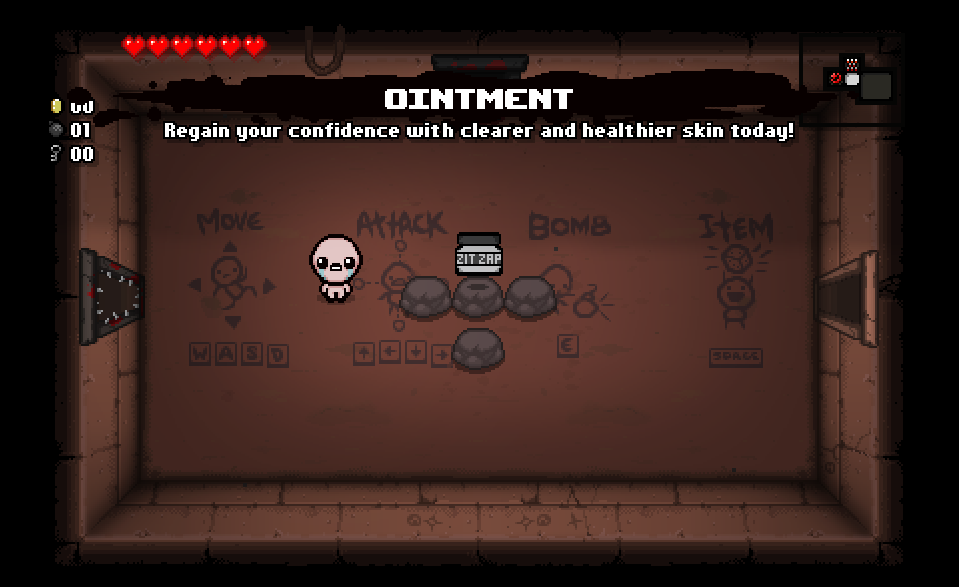

# Item Details

Although **The Binding of Isaac** is a relatively mature game, I wanted to add a custom item that was both thematically fitting and appropriate for younger players.
I felt like **Ointment** was an appropriate addition to the game's item pool, as it fits in with the common theme of items that Isaac might find around his home.

When picking up this passive item it will grant the player fully restored health, an additional heart container, +1 luck, but does come with a longer fire (tear) delay.

It can be found in the following room categories...

- Treasure
- Secret
- Dungeon
- Begger
- Regular Shop
- Greed Shop
- Regular Boss
- Greed Boss
- Regular Angel
- Greed Angel

